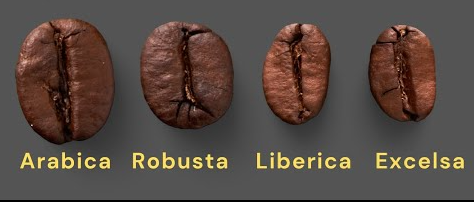
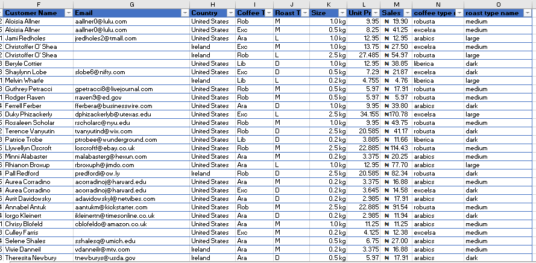
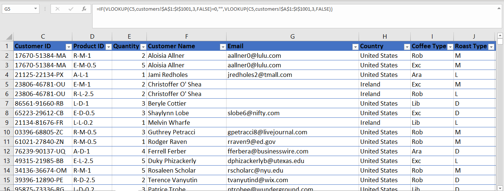
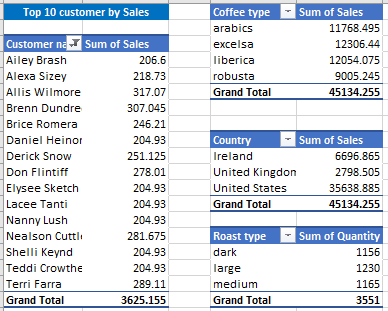
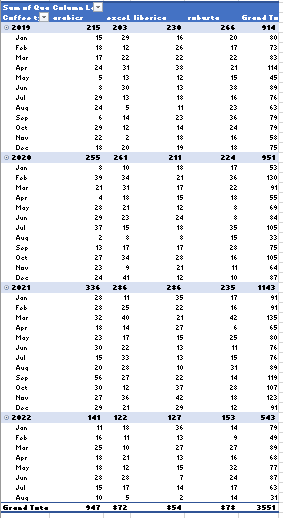

# A-Data-Driven-Insight-into-Coffee-Sales-and-Customer-Preferences

## TABLE OF CONTENT

- [INTRODUCTION](#Introduction)

- [DATA DESCRIPTION](#Data-Description)

- [Data Collection and Preparation ](#Data-Collection-and-Preparation)

- [Data Analysis](#Data-Analysis)

- [Skills demonstrated](#Skills-demonstrated)

- [Visualizations](#Visualizations)

- [Insight from analysis](#Insight-from-analysis)

- [Summary of Analysis](#Summary-of-Analysis)

- [Conclusion](#Conclusion)

## INTRODUCTION
Coffee remains one of the most consumed and profitable products globally. Understanding sales patterns, customer preferences, and product performance is essential for companies to remain agile and responsive to consumer demands. This project focuses on a comprehensive analysis of coffee sales data, which includes diverse variables such as product type, roast level, country of purchase, customer information, pricing, and sales volume.
By exploring this dataset, we aim to uncover key insights into consumer behavior, identify high-performing products, analyze regional preferences, and detect trends across various coffee types such as Robusta, Arabica, Liberica, and Excelsa. The project leverages data analytics techniques to transform raw transactional data into meaningful business intelligence that can support decision-making, marketing strategies, and inventory management.

## DATA DESCRIPTION
The dataset used in this project contains detailed records of coffee product transactions. Each row represents a unique or repeated sales entry involving a customer, product, and transaction details. The table consists of the following key columns Order ID: A unique identifier for each transaction.
 - Order Date: The date the order was placed.
 - Customer ID: A unique code assigned to each customer.
 - Customer Name: Full name of the customer.
 - Email: Email address of the customer.
 - Country: Country of the customer making the purchase.
 - Product ID: Code representing the coffee product.
 - Coffee Type: The variety of coffee sold (e.g., Robusta, Arabica, Liberica, Excelsa).
 - Roast Type: The level of roast (e.g., Medium, Dark, Light).
 - Size: Weight/volume of the product sold (e.g., 0.2 kg, 1.0 kg, 2.5 kg).
 - Unit Price: Price per unit of coffee product.
 - Quantity: Number of units sold.
 - Sales: Total revenue generated for that transaction (Quantity × Unit Price).
 - Coffee Type Name: Descriptive version of the Coffee Type column.
 - Roast Type Name: Descriptive version of the Roast Type column.

## DATA COLLECTION AND PREPARATION 
### Data Sources
The dataset was sourced from a simulated coffee sales record, structured to reflect real-world transactions. It was provided in Excel format and includes details such as order ID, customer information, product type, roast level, size, pricing, and total sales. Though fictional, the data is ideal for practical analysis and visualization tasks.
#### Raw data:
[Download CoffeeorderSales DATASET](coffeeOrdersData.xlsx)
#### Corrected Data:
[Download  corrected Coffee order Sales DATASET](CORRECTEDCOFFEEODERSALE.xlsx)

### Tools used: Excel
    - VLOOKUP
    - IF Statement
    - Pivot Table
    - pivot Chart
    
## SKILLS DEMONSTRATED
  - Filling up the empty column (Customer Name, Email, Country, Coffee Type, 
    Roast Type, Size, Unit Price, Sales on child table (Orders) from Parents table
    (Customers, products) Using VLOOKUP
    

   - Using IF- Statement to make every zero values to empty cells on “email” column under  order table.
       

   - Calculting the Sale column: Sale = Quantity*Unit Price
     
   - Creating another column to make a full meaning of Coffee type (Robusta, Excelsa, Arabics and Liberica) by using IF Statement
     (=IF(I6="rob","robusta",IF(I6="exc","excelsa",IF(I6="ara","arabics",IF(I6="lib","liberica","")))))
     
   - Creating another column For Roast type to make full meaning (Medium,Large, Dark) using If Statement
     (=IF(J5="m","medium",IF(J5="l","large",IF(J5="d","dark"))))

   - Converting the Order Date to more readable format.
      1. Highlight the order Date column
      2. Go to Format, under alignment Settings
      3. click on  Number, enter Custom
      4. On type : dd-mmm-yyyy. then click Ok

   - Converting the size column to Kg.
     1. Highlight The size column
     2. G 2. Go to Format, under alignment Settings
     3. click on  Number, enter Custom
     4. On type : 0.0 "kg", Then click Ok
   - Inserting a Naria sign on Sale column
     1. Highlight the sales
     2. Go to Format, under alignment Settings
     3. Under Format. Click on Accounting, select Yoruba sign
    
   - Removing the Duplicate value on Order Table
   - Format as Table
   - Creating the Pivot Tables
   - Data visualization 
   - Dashboard development 
   - Insight Generation 

## Data Analysis:
•	The following pivot tables and chat were created:
 - Top 10 Customer by Revenue
 - Monthly Sales By Coffee type
 - Coffee type by Revenue
 - Roast Type by Revenue
 - Country by Revenue
   
 

 

